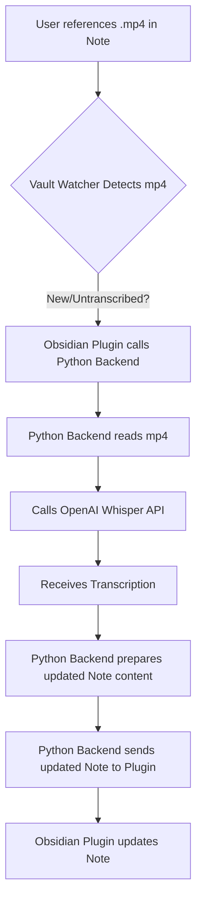

# Project Plan: Obsidian Whisper + LLM Agent Plugin

**Goal:** To build an Obsidian plugin with a Python-based backend agent pipeline for audio transcription, note classification, enrichment, and linking, as detailed in the PRD.

---

### **1. System Architecture Overview**

The solution comprises two main components:

* **Obsidian Plugin (JavaScript/TypeScript):** Handles frontend UI, vault monitoring, triggers, and displays modals for user interaction and approval.
* **Python Agent Backend:** Performs heavy-lifting tasks such as audio transcription, LLM processing (classification, task extraction), and semantic search.

Communication between these two components will be via a local server (e.g., FastAPI) using WebSockets or simple HTTP requests.

```mermaid
graph TD
    A[Obsidian Plugin] -->|Triggers & Requests| B(Python Agent Backend)
    B -->|Transcription (Whisper API)| C[OpenAI Whisper API]
    B -->|LLM Processing (OpenAI API)| D[OpenAI LLM API]
    B -->|Semantic Search (FAISS)| E[Local FAISS Vector Store]
    B -->|Vault Interactions & Updates| A
    A -->|User Input & Approval| F[User]
    F -->|Review & Approve Changes| A
```

---

### **2. Development Phases & Detailed Tasks**

We'll break down the development into several logical phases:

#### **Phase 1: Project Initialization & Core Communication (Foundation)**

* **Objective:** Set up the basic project structure and establish reliable communication between the Obsidian plugin and the Python backend.
* **Status:** **COMPLETED** (as of 2025-06-08)

* **Tasks:**
    1. **Obsidian Plugin Setup:**
        * [x] Initialize a new Obsidian plugin project.
        * [x] Set up basic plugin UI (e.g., a ribbon icon, a settings tab).
    2. **Python Backend Setup:**
        * [x] Create a Python project with a virtual environment.
        * [x] Implement a basic FastAPI server or WebSocket server.
        * [x] Define initial API endpoints or WebSocket handlers for testing communication.
        * [x] Set up `requirements.txt` for Python dependencies (FastAPI, uvicorn, LangChain, etc.).
    3. **Inter-Process Communication (IPC):**
        * [x] Implement calls from the Obsidian plugin (JS) to the Python backend (HTTP/WebSocket).
        * [ ] Implement callback mechanisms for the Python backend to send results back to the plugin. (Basic response handling is implemented, full callback mechanism for complex data not yet)
        * [x] Develop basic "ping-pong" functionality to confirm communication.
    4. **Initial Repo Structure:**
        * [x] Organize the project into `obsidian-plugin/` and `python-backend/` directories.

#### **Phase 2: Transcription Core Functionality**

* **Objective:** Enable the plugin to detect `mp4` references, trigger transcription, and inline the results.
* **Tasks:**
    1. **Vault Monitoring:**
        * Implement `VaultWatcher` in the Obsidian plugin to listen for changes to notes.
        * Develop logic to identify notes containing `![[...mp4]]` embeds.
        * Implement checks to process only new or untranscribed audio (persist transcription status).
    2. **Whisper API Integration:**
        * In the Python backend, integrate with OpenAI Whisper API.
        * Develop a function to transcribe an `mp4` file given its path.
    3. **Transcription Injection:**
        * Develop logic in the Python backend to generate the modified note content with the transcription inlined below the embed.
        * Send the modified content back to the Obsidian plugin.
        * In the Obsidian plugin, implement the functionality to update the note content (initial version without diff/approval modal).



#### **Phase 3: LLM Integration & Note Enrichment**

* **Objective:** Implement LLM-driven features: tag suggestion, task extraction, and semantic linking.
* **Tasks:**
    1. **LangChain Setup:**
        * Integrate LangChain into the Python backend.
        * Set up OpenAI LLM (GPT-4o or GPT-4) within LangChain.
    2. **Tag Suggestion & Classification:**
        * Develop a LangChain agent/chain to classify note text and suggest relevant tags.
        * Handle existing tags for auto-application and new tags for user approval.
    3. **Task Extraction:**
        * Develop a LangChain agent/chain to identify and extract action items from the note text.
        * Format extracted tasks to be inserted under a `## Tasks` section.
    4. **FAISS Semantic Search:**
        * Implement local FAISS vector store management in the Python backend.
        * Develop functions to embed note content and add to the FAISS index.
        * Implement semantic search to find similar notes based on the current note's content.
        * Develop logic to suggest links to similar notes.

#### **Phase 4: User Approval & Undo Mechanism**

* **Objective:** Create a robust user experience for reviewing, approving, and optionally undoing agent-applied changes.
* **Tasks:**
    1. **Diff Generation:**
        * In the Python backend, use `difflib` or a similar library to generate a unified diff between the original and proposed note content.
        * Send the diff along with suggested tags, tasks, and links to the plugin.
    2. **Obsidian Modal UI for Approval:**
        * Design and implement an Obsidian modal (`Modal API`) to display:
            * Read-only transcription.
            * Suggested tags (with approve/reject/edit options).
            * Extracted tasks (with approve/reject/edit options).
            * Suggested links (with individual approve/reject options).
            * A clear diff preview of the entire note.
        * Implement user interactions within the modal (buttons for approval, rejection, editing).
    3. **Change Application & Rollback Pointers:**
        * Upon user approval, the plugin applies the changes.
        * Store a record of agent-applied changes (tags added, tasks inserted, links added) and the previous state to enable undo. This might involve keeping a history of changes in a specific hidden note or a dedicated file.
    4. **Undo Functionality:**
        * Develop an "undo last run" button/command in the plugin that reverts agent-applied changes based on the stored rollback pointers.

```mermaid
graph TD
    A[Agent Backend proposes changes] --> B[Generate Diff & Metadata (Tags, Tasks, Links)];
    B --> C[Send to Obsidian Plugin];
    C --> D[Display Approval Modal];
    D --> E{User approves/rejects};
    E --YES--> F[Obsidian Plugin applies changes];
    E --NO--> G[Changes Rejected];
    F --> H[Store Undo Log];
    H --> I[User Triggers Undo];
    I --> J[Obsidian Plugin Reverts Changes];
```

#### **Phase 5: Logging, Refinements & Testing**

* **Objective:** Enhance transparency, ensure stability, and meet success criteria.
* **Tasks:**
    1. **Agent Trace Logging:**
        * Implement comprehensive logging within the Python backend for each step of the agent's processing pipeline (e.g., input, LLM calls, outputs, errors).
        * Expose this trace to the Obsidian plugin for display (e.g., in a separate log modal or specific log file).
    2. **Error Handling & Robustness:**
        * Implement error handling for API calls (Whisper, OpenAI) and file operations.
        * Graceful degradation for network issues or API limits.
    3. **Performance Optimization:**
        * Optimize FAISS performance for large vaults.
        * Consider caching mechanisms for API calls or transcriptions.
    4. **Comprehensive Testing:**
        * Unit tests for Python backend modules.
        * Integration tests for plugin-backend communication.
        * Manual testing of all user stories and approval workflows.
    5. **Documentation:**
        * Update `README.md` with installation, usage, and development instructions.
        * Document API endpoints and data flows.

---

### **3. Next Steps & User Approval**

Once this plan is approved, we can proceed with generating initial code templates and specific implementation details.
